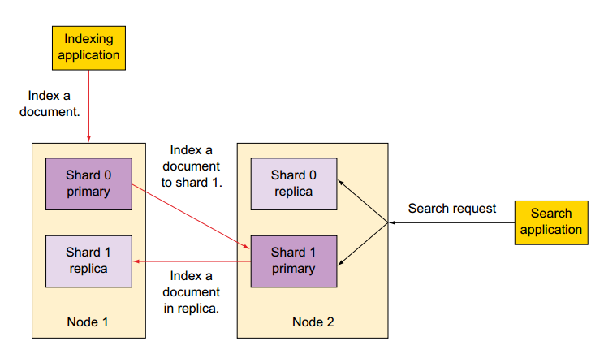
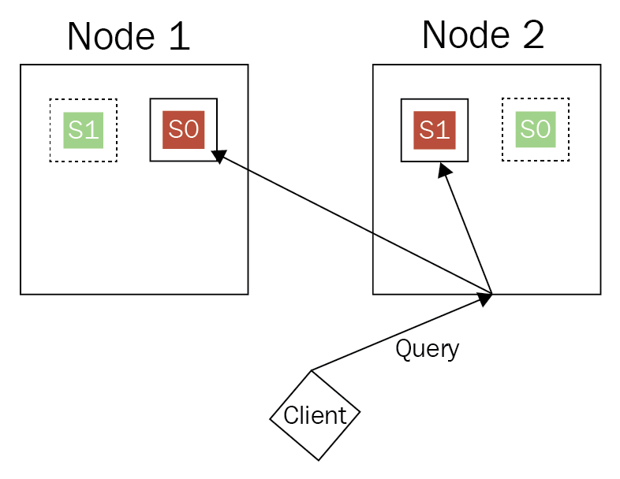
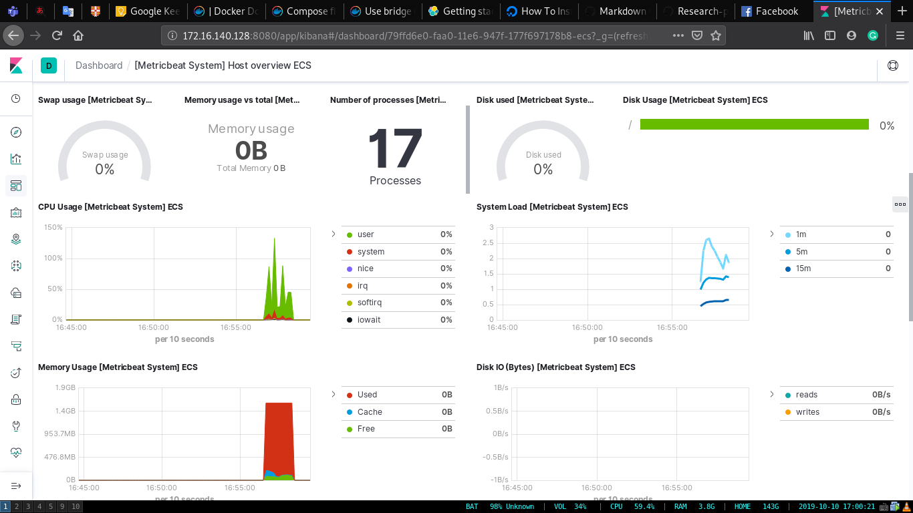

# ElasticSearch
---
## Table of content
- [Elasticsearch overview](#elasticsearch-overview)
  - [1. What is Elasticsearch](#1-what-is-elasticsearch)
  - [2. What is Elasticsearch used for?](#2-what-is-elasticsearch-used-for)
  - [3. Why use Elasticsearch?](#3-why-use-elasticsearch)
  - [4. How it's work](#4-how-its-work)
- [Elastic Stack](#elastic-stack)
  - [1. What is ElasticStack](#1-what-is-elasticstack)
  - [2. ElasticSearch](#2-elasticsearch)
  - [3. Kibana](#3-kibana)
  - [4. Beats](#4-beats)
  - [5. Logstash](#5-logstash)
- [Setup system monitor](#setup-system-monitor)
  - [centos 7](#centos-7)
  - [Deploy using docker compose](#deploy-using-docker-compose)
- [Demo](#demo)
- [Reference](#reference)
---
## Elasticsearch overview
### 1. What is Elasticsearch

- Elasticsearch is a distributed, open source search and analytics engine for all types of data, including textual, numerical, geospatial, structured, and unstructured.
- Elasticsearch is built on Apache Lucene and was first released in 2010 by Elasticsearch N.V. (now known as Elastic).
- Known for its simple REST APIs, distributed nature, speed, and scalability, Elasticsearch is the central component of the Elastic Stack, a set of open source tools for data ingestion, enrichment, storage, analysis, and visualization.
### 2. What is Elasticsearch used for?
- The speed and scalability of Elasticsearch and its ability to index many types of content mean that it can be used for a number of use cases: 
  - Application search
  - Website search
  - Enterprise search
  -  Logging and log analytics
  - Infrastructure metrics and container monitoring
  -  Application performance monitoring
  - Geospatial data analysis and visualization
  - Security analytics
  - Business analytics
### 3. Why use Elasticsearch?

- Elastic search is fast
- Elasticsearch is distributed by nature
- Elasticsearch comes with a wide set of features
- The Elastic Stack simplifies data ingest, visualization, and reporting
- Horizontal scaling
- Elasticsearch supports a variety of languages and official clients are available for: 
  - Java
  - JavaScript (Node.js)
  - Go
  - .NET (C#)
  - PHP
  - Perl
  - Python
  - Ruby
- Elasticsearch [provides a comprehensive and powerful set of REST APIs](https://www.elastic.co/guide/en/elasticsearch/reference/current/docs.html) for performing tasks such as checking cluster health, performing CRUD (Create, Read, Update, and Delete) and search operations against indices, and executing advanced search operations such as filtering and aggregations.
- Elasticsearch supports **34 text languages**, from Arabic to Thai, and provides analyzers for each. The full list can be found in [the Elasticsearch Language Analyzer documentation](https://www.elastic.co/guide/en/elasticsearch/reference/current/analysis-lang-analyzer.html). Support for additional languages can be added with custom plugins. 
### 4. How it's work
| RDBMS terminology | ElasticSearch Terminology |
| ----------------- | ------------------------- |
| database          | index                     |
| table             | type                      |
| row               | document                  |
- **Inverted index**
  - We can compare an inverted index to an old library catalog card system. When you need some information/book in a library, you will use the card catalog, usually at the entrance of the library, to find the book.
  - Without the inverted index, the application has to go through each web page and check whether the word exists in the web page. Example:
1. Fear leads to anger
2. Anger leads to hate
3. Hate leads to suffering

| keywork   | document |
| --------- | -------- |
| fear      | 1        |
| anger     | 1, 2     |
| hate      | 2, 3     |
| suffering | 3        |
| lead      | 1, 2, 3  |

- **Stemming**
  - Stemming is the process of reducing a derived word into its root word. For example, rain, raining, rained, rainfall has the common root word “rain”. When a document is indexed, the root word is stored in the index instead of the actual word. Without stemming, we end up storing rain, raining, rained in the index, and search relevance would be very low. 
  
- **Synonyms**
  - Similar to rain and raining, weekend and sunday mean the same thing. The document might not contain Sunday, but if the information retrieval system can also search for synonyms, it will significantly improve the search quality.
  - Example
    - incredible, unbelievable, improbable, fabulous, wonderful, fantastic, astonishing, astounding, extraordinary -> **Amazing**
    - mad, furious, enraged, excited, wrathful, indignant, exasperated, aroused, inflamed -> **Angry**
    - start, open, launch, initiate, commence, inaugurate, originate -> **Begin**
    - ....
- **Phrase search**
  - As a user, we almost always search for phrases rather than single words. The inverted index in the previous section would work great for individual terms but not for phrases. Continuing the previous example, if we want to query all the documents with a phrase **anger leads**, the previous index would not be sufficient.
  - To support phrase search along with the document, we also need to record the position of the word in the document. The inverted index with word position is shown here:
  
| keywork   | document      |
| --------- | ------------- |
| fear      | 1:1           |
| anger     | 1:3, 2:1      |
| hate      | 2:3, 3:1      |
| suffering | 3:3           |
| lead      | 1:2, 2:2, 3:2 |

- **Scalability and availability**
  - Let’s say you want to index a billion documents; having just a single machine might be very challenging. Partitioning data across multiple machines allows Elasticsearch to scale beyond what a single machine do and support high throughput operations. Your data is split into small parts called **shards**. As you have more data, you can scale **horizontally** by adding more machines.
  - There are type of shards in Elasticsearch – **primary** and **replica**. The data you index is written to both primary and replica shards. Replica is the exact copy of the primary. In case of the node containing the primary shard goes down, the replica takes over.

- **Distributed Search**
  - One of the reasons queries executed on Elasticsearch are so fast is because they are **distributed**. Multiple shards act as one index. A search query on an index is executed in parallel across all the shards.
  - Let’s take an example: in the following figure, we have a cluster with two nodes: Node1, Node2 and an index named chapter1 with two shards: S0, S1 with one replica:
  
  - Assuming the chapter1 index has 100 documents, S1 would have 50 documents, and S0 would have 50 documents. And you want to query for all the documents that contain the word Elasticsearch. The query is executed on S0 and S1 in **parallel**. The results are gathered back from both the shards and sent back to the client.
---
## Elastic Stack

### 1. What is ElasticStack
- "**ELK**" is the acronym for four open source projects: **Elasticsearch**, **Logstash**, **Beats**, and **Kibana**. Elasticsearch is a search and analytics engine. Logstash is a server‑side data processing pipeline that ingests data from multiple sources simultaneously, transforms it, and then sends it to a "stash" like Elasticsearch. Kibana lets users visualize data with charts and graphs in Elasticsearch.
### 2. ElasticSearch
- Elasticsearch is a real-time, distributed storage, search, and analytics engine. It can be used for many purposes, but one context where it excels is indexing streams of semi-structured data, such as logs or decoded network packets.
### 3. Kibana
- Kibana is an open source analytics and visualization platform designed to work with Elasticsearch. You use Kibana to search, view, and interact with data stored in Elasticsearch indices. You can easily perform advanced data analysis and visualize your data in a variety of charts, tables, and maps.
### 4. Beats
- The Beats are open source data shippers that you install as agents on your servers to send operational data to Elasticsearch. Beats can send data directly to Elasticsearch or via Logstash, where you can further process and enhance the data.
### 5. Logstash
- Logstash is a powerful tool that integrates with a wide variety of deployments. It offers a large selection of plugins to help you parse, enrich, transform, and buffer data from a variety of sources. If your data requires additional processing that is not available in Beats, then you need to add Logstash to your deployment.

---
## Setup System Monitoring
### Centos 7
#### ElasticSearch service
- Run the following command to download and install the Elasticsearch public signing key.
```
$ sudo rpm --import https://artifacts.elastic.co/GPG-KEY-elasticsearch
```
- Next, add the Elastic repository at ``/etc/yum.repos.d/elasticsearch.repo``.
```
[elasticsearch-7.x]
name=Elasticsearch repository for 7.x packages
baseurl=https://artifacts.elastic.co/packages/7.x/yum
gpgcheck=1
gpgkey=https://artifacts.elastic.co/GPG-KEY-elasticsearch
enabled=1
autorefresh=1
type=rpm-md
```
- Install elastic search with command
```
$ sudo yum -y install elasticsearch
```
- Elastic search configuration at file ``/etc/elasticsearch/elasticsearch.yml``
- Start then enable service
```
$ sudo systemctl start elasticsearch
```
```
$ sudo systemctl enable elasticsearch
```
- Elasticsearch is listening at port ``9200``, so if you want to verify that elastic search already running, use command
```
$ curl -X GET "localhost:9200"
```
- Output will similar like this
```
{
  "name" : "localhost.localdomain",
  "cluster_name" : "elasticsearch",
  "cluster_uuid" : "lzWtkhTyQhKblhfTDmtDjw",
  "version" : {
    "number" : "7.4.0",
    "build_flavor" : "default",
    "build_type" : "rpm",
    "build_hash" : "22e1767283e61a198cb4db791ea66e3f11ab9910",
    "build_date" : "2019-09-27T08:36:48.569419Z",
    "build_snapshot" : false,
    "lucene_version" : "8.2.0",
    "minimum_wire_compatibility_version" : "6.8.0",
    "minimum_index_compatibility_version" : "6.0.0-beta1"
  },
  "tagline" : "You Know, for Search"
}
```
#### Kibana service
- Install kibana
```
$ sudo yum -y install kibana
```
- Configure file at ``/etc/kibana/kibana.yml``
- Start and enable service
```
$ sudo systemctl start kibana
```
```
$ sudo systemctl enable kibana
```
- Because Kibana is configured to only listen on ``localhost``, we must set up a reverse proxy to allow external access to it. We will use ``Nginx`` for this purpose.
#### Nginx service
- Nginx will act like a reverse proxy, allow outside network can access kibana.
- Install nginx
```
$ sudo yum -y install nginx
```
- Create file ``/etc/nginx/conf.d/kibana.conf``
```
server {
    listen 8080;

    location / {
        proxy_pass http://kibana:5601;
        proxy_http_version 1.1;
        proxy_set_header Upgrade $http_upgrade;
        proxy_set_header Connection 'upgrade';
        proxy_set_header Host $host;
        proxy_cache_bypass $http_upgrade;
    }
}
```
- Start and enable nginx
```
$ sudo systemctl start nginx
```
```
$ sudo systemctl enable nginx
```
#### Beat service
- We will use metricbeat service for this demo, collect metrics from your systems and services. From CPU to memory, Redis to NGINX, and much more, Metricbeat is a lightweight way to send system and service statistics.
- Install metricbeat
```
$ sudo yum -y install metricbeat
```
- Ship system metric to elasticsearch
```
$ sudo metricbeat modules enable system
```
- Setup initial environment
```
$ sudo metricbeat setup -e
```
- Start and enable metricbeat service
```
$ sudo systemctl start metricbeat
```
```
$ sudo systemctl enable metricbeat
```
###  Deploy using docker compose
```
version: '3'
services:
  elasticsearch:
    build: ./elastic-search
    ports:
      - "9200:9200"
      - "9300:9300"
    environment:
      - discovery.type=single-node
    networks:
      - elknet
  kibana:
    build: ./kibana
    ports: 
      - "5601:5601"
    depends_on:
      - elasticsearch
    networks:
      - elknet
  nginx:
    build: ./nginx
    ports: 
      - "8080:8080"
    depends_on:
      - kibana
    networks:
      - elknet
networks:
  elknet:  
```
---
## Demo
- Connect to kibana at port ``8080``

---
## Reference
- https://towardsdatascience.com/an-overview-on-elasticsearch-and-its-usage-e26df1d1d24a
- https://dzone.com/articles/what-is-elasticsearch-and-how-it-can-be-useful
- https://www.elastic.co/what-is/elasticsearch
- https://hub.packtpub.com/how-does-elasticsearch-work-tutorial/
- https://www.elastic.co/guide/en/elastic-stack-get-started/current/get-started-elastic-stack.html
- https://www.digitalocean.com/community/tutorials/how-to-install-elasticsearch-logstash-and-kibana-elastic-stack-on-centos-7